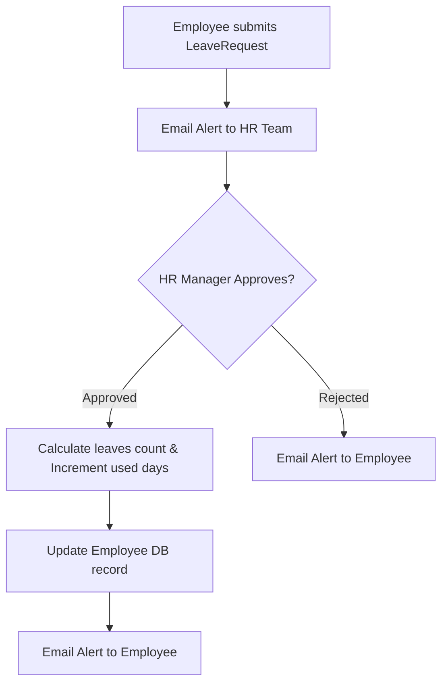

# 👥 OrganiStation HR Service

The **HR Service** is a core Python FastAPI microservice responsible for the employee lifecycle, department rosters, attendance tracking, leave/WFH applications, and job recruitment postings.

---

## ✨ Key Features

- **Employee Profile Management**: Stores and updates details including role designations, position metadata, salary, and current status (active/inactive).
- **Leave & WFH Management**: 
  - Allows employees to apply for sick, annual, and unpaid leaves.
  - Automatically sends email alerts to the HR department upon request submission.
  - Tracks specific user balances (Annual, Sick, WFH totals vs. used).
  - Recalculates remaining balances and auto-notifies the applicant via email when requests are approved or rejected.
- **Attendance Registry**: Logs check-in/check-out timestamps and daily status for employee attendance records.
- **Recruitment Boards**: Manages job listings, details, and application statuses.
- **Automatic Indexing**: On startup, it establishes performance indexes:
  - `employees` (unique, sparse index on `email`)
  - `leave_requests` (index on `employee_id`)
  - `jobs` (index on `title`)
- **Cascaded Cleanup Integration**: Cleans up all related attendance logs, leave records, and employee metadata upon user removal via an internal `/api/internal/purge-user` route protected by an internal secret.

---

## 🛠️ Technology Stack

- **Framework**: FastAPI (Python 3.10+)
- **Database**: MongoDB (via `motor` asynchronous driver)
- **Communications**: HTTP requests via `urllib.request` (async runner executor)

---

## 📂 Leave Application Lifecycle



---

## ⚙️ Configuration & Environment Variables

Create a `.env` file in the root of the `hr-service` directory (you can copy `.env.example` as a template).

| Variable | Description | Default | Required |
| :--- | :--- | :--- | :--- |
| `PORT` | Service port | `8002` | No |
| `HOST` | Bind address | `0.0.0.0` | No |
| `MONGODB_URI` | Connection URI for MongoDB | `mongodb://localhost:27017` | Yes |
| `DB_NAME` | Database name | `organistation_hr` | No |
| `INTERNAL_SERVICE_SECRET` | Secret to authenticate internal user purge requests | `organistation_internal_secret` | Yes (in Prod) |

---

## 🚀 API Endpoints

### 👥 Employee Profile Endpoints (`/api/employees`)

* **`GET /api/employees`**: List all employees.
* **`POST /api/employees`**: Create a new employee profile (initializes default leave balances).
* **`GET /api/employees/{eid}`**: Get an employee profile by ID.
* **`PUT /api/employees/{eid}`**: Update employee details.
* **`DELETE /api/employees/{eid}`**: Cascade deletes employee metadata, attendance logs, and leave history.

---

### 🕒 Attendance Endpoints (`/api/attendance`)

* **`GET /api/employees/{eid}/attendance`**: Fetch attendance logs for a specific employee.
* **`POST /api/attendance`**: Log a check-in/check-out session.

---

### 🌴 Leave Management Endpoints (`/api/leaves`)

* **`GET /api/leaves`**: List all leave requests (ordered newest first). Optional query filter: `employee_id`.
* **`POST /api/leaves`**: Apply for leave (sends email alert to HR).
* **`PUT /api/leaves/{lid}`**: Approve or reject a leave request (updates balance and notifies applicant).

---

### 💼 Recruitment Endpoints (`/api/jobs`)

* **`GET /api/jobs`**: List all posted job openings.
* **`POST /api/jobs`**: Create a new job opening listing.

---

### 🔒 Internal Endpoints (Requires `X-Internal-Secret` header)

* **`POST /api/internal/purge-user`**:
  - Drops employee profiles, leaves, and attendance logs associated with the purged email address.

---

## 💻 Local Development

### 1. Setup Virtual Environment
```bash
python -m venv venv
source venv/bin/activate  # On Windows: .\venv\Scripts\activate
pip install -r requirements.txt
```

### 2. Configure MongoDB
Ensure MongoDB is running locally on port `27017` or update the `MONGODB_URI` in `.env`.

### 3. Run the Server
```bash
python app.py
```
The server will start at `http://localhost:8002`. You can access interactive API docs at `http://localhost:8002/docs`.

---

## 🐳 Docker Deployment

To build and run the service inside a Docker container:

```bash
# Build the Image
docker build -t organistation-hr-service .

# Run the Container
docker run -d \
  -p 8002:8002 \
  --env-file .env \
  organistation-hr-service
```
